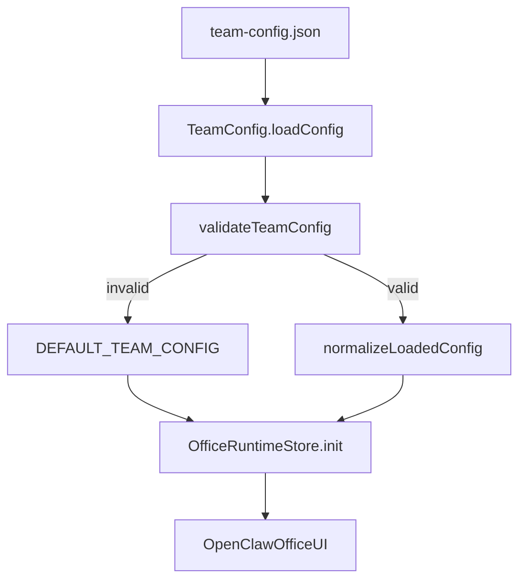

# Team Config Flow

Topic: `team-config`
Status: current first-slice flow

## Purpose

`TeamConfig` is the source of truth for:

- team metadata
- agent definitions
- roles and personas
- per-agent AI selection
- channels
- default runtime-facing schedules
- team skill-loading conventions
- per-agent workspace conventions

The current implementation is file-backed through `src/team-config.json` and validated by `src/team-config.js`.

Related runtime conventions:
- team skills load from `/root/.openclaw/skills/${TEAM_NAME}/`
- per-agent workspace files live under `~/.openclaw/agents/{id}/workspace/`

## Input

File:
- `src/team-config.json`

Required shape:
- `team`: string
- `agents`: non-empty array

Required agent fields:
- `id`
- `name`
- `role`
- `ai.provider`
- `ai.model`
- `ai.apiKeyEnv`
- `channels`
- `sprite`

Current agent workspace convention:
- `SOUL.md`: identity, persona, tool routing, non-negotiables
- `AGENTS.md`: roles, delegation rules, workflow pointer
- `TOOLS.md`: ready-to-use service commands for that agent
- `IDENTITY.md`: stable agent id and display name

Current team skill convention:
- `SKILL.md`: platform service routing
- `KM.md`: Obsidian vault read/write SOP
- `WORKFLOW.md`: complexity triage, planning, verification
- `COMMUNICATION.md`: structural communication rules

## Current Flow

## Validation Rules

- config must be an object
- `team` must be a string
- `agents` must exist and contain at least one agent
- each agent id must be unique
- each agent must include `name`, `role`, `ai`, `channels`, and `sprite`
- `ai.provider` must be `deepseek` or `gemini`
- `ai.model` must be a non-empty string
- `ai.apiKeyEnv` must be a non-empty string naming the env var that stores the secret

## State Transition

This flow does not create run state. Its output is a validated team definition used to initialize runtime state.

## Output

On success:
- normalized config object is passed into `OfficeRuntimeStore.init`
- each runtime agent record exposes `ai.provider`, `ai.model`, and `ai.apiKeyEnv`

On failure:
- browser falls back to `DEFAULT_TEAM_CONFIG`

## Failure Cases

- missing `team-config.json`
- malformed JSON
- duplicate agent ids
- missing required agent fields
- unsupported AI provider
- missing AI model or API key env reference

## Notes

- This is a browser-side control-plane flow in the first implementation slice.
- If a server-side control plane is added later, this document should be updated to describe the new source-of-truth path.
