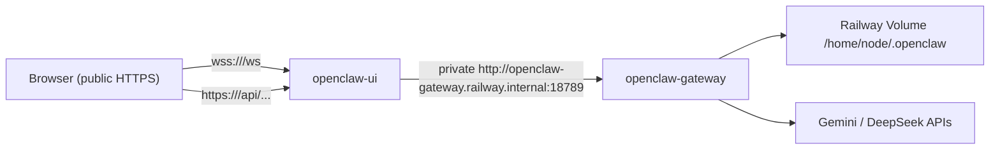

# Deploy OpenClaw Office บน Railway

คู่มือนี้ใช้สำหรับแยก stack เดิมจาก `docker-compose.yml` ออกเป็น 2 Railway services:

- `openclaw-gateway` รัน OpenClaw gateway แบบ private network
- `openclaw-ui` รัน nginx + static UI และ proxy เข้า gateway ผ่าน `railway.internal`

## Architecture

Railway ไม่รัน `docker-compose.yml` ตรง ๆ ดังนั้นต้อง deploy แต่ละ service แยกกันในโปรเจคเดียว แล้วให้ UI คุยกับ gateway ผ่าน private network



Mapping จาก repo ปัจจุบัน:

- `docker-compose.yml` แยกเป็น 2 services บน Railway
- `docker/Dockerfile.ui` ใช้ build UI service
- `docker/nginx.railway.conf.template` ใช้ proxy `/ws` และ `/api/` ไปที่ gateway
- `src/openclaw-api.js` จะ auto-detect `wss://<current-host>/ws` เมื่อไม่ใช่ `localhost`

## ข้อควรรู้ก่อนเริ่ม

1. Gateway ควรเป็น private only และไม่ควรกด `Generate Domain`
2. UI service ต้องรู้ `OPENCLAW_GATEWAY_TOKEN` ค่าเดียวกับ gateway เพื่อให้ nginx ใส่ `Authorization: Bearer ...` ไปที่ upstream อัตโนมัติ
3. UI ปัจจุบันยังไม่มีหน้า login หรือ prompt สำหรับ user-level token โดยตรง
4. ถ้าคุณเปิด public domain ให้ UI คนที่เข้าถึง URL ได้ก็ยังใช้งาน UI ได้ทันที เว้นแต่คุณจะเพิ่มชั้น auth ด้านหน้าเอง เช่น Cloudflare Access, Tailscale Funnel, หรือ Basic Auth

สรุปสั้น ๆ คือ gateway token ในคู่มือนี้เป็น **backend token ระหว่าง nginx กับ gateway** ไม่ใช่ end-user login ของหน้าเว็บ

## Prerequisites

- Railway account
- GitHub repo ของโปรเจคนี้
- Railway CLI (`npm i -g @railway/cli`)
- API keys สำหรับ provider ที่จะใช้ เช่น `GEMINI_API_KEY` หรือ `DEEPSEEK_API_KEY`
- token แบบสุ่มยาวอย่างน้อย 32 bytes

สร้าง token:

```bash
openssl rand -hex 32
```

## ไฟล์ที่เกี่ยวข้อง

- `docker/Dockerfile.ui`
- `docker/nginx.railway.conf.template`
- `.env.railway.example`

ใช้ `.env.railway.example` เป็น checklist ของตัวแปรที่ต้องใส่ใน Railway dashboard แยกตาม service

## Step 1: Push repo ขึ้น GitHub

Railway จะ build UI service จาก repo นี้โดยตรง ดังนั้นให้ push branch ที่มีไฟล์ต่อไปนี้ขึ้น GitHub ก่อน:

- `docker/Dockerfile.ui`
- `docker/nginx.railway.conf.template`
- `src/openclaw-api.js`

## Step 2: สร้าง Railway project

```bash
railway login
railway init
```

จากนั้นสร้าง 2 services ใน project เดียวกัน:

- `openclaw-gateway`
- `openclaw-ui`

## Step 3: Deploy `openclaw-gateway`

ใน Railway dashboard:

1. `New Service`
2. เลือก `Deploy from Image`
3. ใช้ image: `ghcr.io/openclaw/openclaw:latest`
4. ตั้งชื่อ service เป็น `openclaw-gateway`

### Variables ของ gateway

ตั้งค่าตัวแปรอย่างน้อย:

```env
GEMINI_API_KEY=...
DEEPSEEK_API_KEY=...
OPENCLAW_GATEWAY_TOKEN=<random-hex-token>
```

ถ้าต้องการเก็บเป็น reference สำหรับตัวเอง ให้ดูตัวอย่างใน `.env.railway.example`

### Volume

เพิ่ม Railway Volume ให้ service นี้แล้ว mount ที่:

```text
/home/node/.openclaw
```

ถ้าไม่มี volume ข้อมูล onboarding, config, และ state ของ gateway จะหายทุกครั้งที่ deploy ใหม่

### Start Command

ตั้ง start command เป็น:

```bash
node dist/index.js gateway --bind 0.0.0.0 --port 18789
```

หมายเหตุ:

- Railway ไม่ใช้ `localhost` แบบเครื่อง local เดิม ควร bind ที่ `0.0.0.0`
- ไม่ต้อง generate public domain ให้ service นี้

## Step 4: Run onboarding และตั้งค่า gateway auth

หลังสร้าง service กับ volume แล้ว ให้ init config ครั้งแรกผ่าน Railway CLI

```bash
railway run --service openclaw-gateway -- node dist/index.js onboard
```

จากนั้นตั้งค่า gateway ให้ใช้ token auth:

```bash
railway run --service openclaw-gateway -- node dist/index.js config set gateway.auth.mode token
railway run --service openclaw-gateway -- node dist/index.js config set gateway.auth.token "$OPENCLAW_GATEWAY_TOKEN"
railway run --service openclaw-gateway -- node dist/index.js config set gateway.bind 0.0.0.0
```

ถ้า image/release ที่คุณใช้มี binary `openclaw` อยู่ใน `PATH` อยู่แล้ว สามารถแทน `node dist/index.js` ด้วย `openclaw` ได้

เช็กค่าที่ตั้งไว้:

```bash
railway run --service openclaw-gateway -- node dist/index.js config get gateway.auth.mode
railway run --service openclaw-gateway -- node dist/index.js config get gateway.bind
```

## Step 5: Deploy `openclaw-ui`

ใน Railway dashboard:

1. `New Service`
2. เลือก `Deploy from GitHub Repo`
3. ชี้มาที่ repo นี้
4. ตั้งชื่อ service เป็น `openclaw-ui`

ตั้ง Dockerfile path เป็น:

```text
docker/Dockerfile.ui
```

หรือจะตั้งผ่าน variable ก็ได้:

```env
RAILWAY_DOCKERFILE_PATH=docker/Dockerfile.ui
```

### Variables ของ UI

ตั้งค่า:

```env
GATEWAY_HOST=openclaw-gateway.railway.internal
OPENCLAW_GATEWAY_TOKEN=<same-token-as-gateway-service>
```

nginx template จะใช้ค่าพวกนี้เพื่อ:

- listen บน `$PORT` ที่ Railway inject มาให้
- proxy `/ws` ไปที่ `http://openclaw-gateway.railway.internal:18789`
- proxy `/api/` ไปที่ `http://openclaw-gateway.railway.internal:18790/`
- ใส่ `Authorization: Bearer $OPENCLAW_GATEWAY_TOKEN` ให้ upstream อัตโนมัติ

### Public Domain

กด `Generate Domain` เฉพาะที่ `openclaw-ui`

เมื่อ deploy สำเร็จ UI จะได้ public URL แบบ:

```text
https://openclaw-ui-production-xxxx.up.railway.app
```

## Step 6: เพิ่ม agents ผ่าน Railway CLI

ตัวอย่างเพิ่ม agent:

```bash
railway run --service openclaw-gateway -- node dist/index.js agents add work --workspace /home/node/.openclaw/workspace-work
```

ตัวอย่าง bind Telegram:

```bash
railway run --service openclaw-gateway -- node dist/index.js agents bind --agent work --bind telegram:<TOKEN>
```

ดู agents ทั้งหมด:

```bash
railway run --service openclaw-gateway -- node dist/index.js agents list
```

## Security Checklist

- `openclaw-gateway` ไม่มี public domain
- `OPENCLAW_GATEWAY_TOKEN` เป็นค่าสุ่มใหม่ ไม่ reuse จากระบบอื่น
- UI service ใช้ token ค่าเดียวกับ gateway service
- Railway Volume ถูก mount ที่ `/home/node/.openclaw`
- อย่า commit `.env` จริงหรือ token ลง repo
- ถ้าจะเปิด UI เป็น public URL จริง ควรเพิ่ม access control ด้านหน้าอีกชั้น

ตัวเลือก access control ที่ปลอดภัยกว่า:

1. Cloudflare Access หน้า UI
2. Tailscale + private access
3. Basic Auth ที่ reverse proxy อีกชั้น

## Troubleshooting

### UI โหลดได้ แต่ WebSocket ต่อไม่ได้

เช็ก 4 จุดนี้ก่อน:

1. `openclaw-ui` มี `OPENCLAW_GATEWAY_TOKEN` ค่าเดียวกับ gateway
2. `openclaw-gateway` มี config `gateway.auth.mode=token`
3. service name เป็น `openclaw-gateway` จริง ถ้าเปลี่ยนชื่อ ต้องเปลี่ยน `GATEWAY_HOST` ให้ตรง
4. gateway service ฟังที่ `18789`

### ได้ 502 จาก `/ws` หรือ `/api/`

สาเหตุที่เจอบ่อย:

- gateway ยังไม่ healthy
- volume ยังไม่ผ่าน onboarding
- `GATEWAY_HOST` ชี้ผิด service
- gateway bind ผิดค่า

### Deploy ผ่าน แต่ state หายหลัง redeploy

ยังไม่ได้ attach volume หรือ mount path ไม่ใช่ `/home/node/.openclaw`

### เปิด public UI แล้วรู้สึกไม่ปลอดภัย

อันนี้เป็นข้อจำกัดจริงของ UI เวอร์ชันนี้: มันยังไม่มี end-user auth ของตัวเอง ถ้าต้องการ public แบบปลอดภัยกว่าควรเพิ่ม access layer ข้างหน้า UI หรือเปลี่ยนไปใช้ private access แทน

## Cost และข้อจำกัด

- Railway รองรับ workflow นี้ได้ดีสำหรับ personal deployment หรือ internal control plane
- ค่าใช้จ่ายของ volume, usage, และ included credits เปลี่ยนได้ตามแผนราคา Railway ในช่วงเวลานั้น
- ก่อนใช้งานจริงควรเช็กราคาและ limits ล่าสุดจาก Railway โดยเฉพาะเรื่อง persistent volume และ sleep policy

## สรุป

โครงสร้างที่แนะนำบน Railway คือ:

- gateway private
- UI public หรือ semi-private
- state เก็บใน volume
- ใช้ gateway token ระหว่าง UI proxy กับ gateway

ถ้าต้องการความปลอดภัยมากกว่านี้ ให้เพิ่มชั้น auth ด้านหน้า UI แทนการ expose แบบ public เปล่า ๆ
